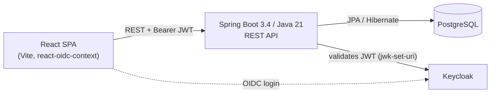

# ShowHop — Product Requirements Document

**Version:** 0.1.0
**Status:** MVP complete
**Stack:** Spring Boot 3.4 / Java 21 / React 18 + Vite / PostgreSQL / Keycloak

---

## 1. Overview

ShowHop is an event ticketing platform. **Organizers** create events with
multiple ticket types, **attendees** discover and buy tickets, and **staff**
validate tickets at the door by QR code or manual entry.

This document describes the platform as it actually exists at `v0.1.0` —
every claim below is checked against the codebase, not aspirational. The
roadmap section (§8) describes what's planned next but not yet built.

## 2. Users & Roles

One `User` entity, three Keycloak realm roles. A person can hold more than
one role; the local database doesn't distinguish them beyond that.

| Role | Primary jobs |
|---|---|
| **Organizer** | Create/edit events, manage ticket types and pricing |
| **Attendee** | Browse published events, buy tickets, view QR codes |
| **Staff** | Validate tickets at the door, by QR scan or manual entry |

## 3. Architecture & Stack

| Layer | Choice |
|---|---|
| Web | Spring MVC (`spring-boot-starter-web`) |
| Persistence | Spring Data JPA + Flyway-managed PostgreSQL schema |
| Auth | OAuth2 Resource Server, Keycloak realm roles → Spring authorities |
| Mapping | MapStruct |
| QR codes | ZXing, rendered on demand (not cached) |
| Frontend auth | `react-oidc-context` (Authorization Code + PKCE) |
| Testing | JUnit 5 + Mockito (unit/slice), a real-Postgres integration suite via `docker compose` (see `docs/adr/0001`) |

## 4. Domain Model

Six entities, UUID-keyed, with `createdAt`/`updatedAt` audit columns.

| Entity | Key fields | Relations |
|---|---|---|
| **User** | `id` (= Keycloak subject), `name`, `email` | 1–N organized events; N–1 purchaser on tickets |
| **Event** | `name`, `venue`, `startsAt`, `endsAt`, `salesStart`, `salesEnd`, `status` | N–1 organizer; 1–N ticketTypes |
| **TicketType** | `name`, `description`, `price` (BigDecimal), `totalAvailable` | N–1 event; 1–N tickets |
| **Ticket** | `status` | N–1 ticketType; N–1 purchaser; 1–N validations; 1–1 QR code |
| **QrCode** | `status`, `generatedAt` | 1–1 ticket |
| **TicketValidation** | `status`, `method`, `validatedAt` | N–1 ticket; N–1 validating staff user (append-only log) |

`EventStatus`: DRAFT / PUBLISHED / CANCELLED / COMPLETED.
`TicketStatus`: PURCHASED / CANCELLED.
`TicketValidationStatus`: VALID / INVALID / EXPIRED.
`TicketValidationMethod`: QR_SCAN / MANUAL.

## 5. API Surface

| Method | Path | Access |
|---|---|---|
| POST/GET | `/api/v1/events` | ORGANIZER |
| GET/PUT/DELETE | `/api/v1/events/{id}` | ORGANIZER, ownership-checked |
| POST/GET/PUT/DELETE | `/api/v1/events/{eventId}/ticket-types[/{id}]` | ORGANIZER, ownership-checked |
| GET | `/api/v1/published-events[?q=]` | public |
| GET | `/api/v1/published-events/{id}` | public |
| GET | `/api/v1/published-events/{id}/ticket-types` | public |
| POST | `/api/v1/published-events/{eventId}/ticket-types/{id}/tickets` | any authenticated role (purchase) |
| GET | `/api/v1/tickets` / `/api/v1/tickets/{id}` | authenticated, own tickets only |
| GET | `/api/v1/tickets/{id}/qr-codes` | authenticated, own ticket only — PNG |
| POST | `/api/v1/ticket-validations` | STAFF |

Ticket purchase deliberately lives under `/published-events`, not
`/events` — the ORGANIZER-only matcher on `/api/v1/events/**` would
otherwise lock attendees out of buying tickets.

## 6. Security Model

- Keycloak issues JWTs; Spring Security validates them statelessly via
  `jwk-set-uri` (not `issuer-uri` — the latter does an eager OIDC-discovery
  network call at bean creation, which would make every context load,
  including plain tests, depend on Keycloak being reachable).
- A custom `JwtAuthenticationConverter` maps `realm_access.roles` onto
  Spring authorities.
- `UserProvisioningFilter` creates the local `User` row just-in-time from
  JWT claims on first authenticated request — no separate signup flow.
- Authorization is enforced at two levels: role-gated path matchers in
  `SecurityConfig`, and per-resource ownership checks in the service layer
  (e.g. `findByIdAndOrganizerId`).

## 7. Correctness Guarantees

- **Oversell-safe purchasing**: a `PESSIMISTIC_WRITE` lock on the
  `TicketType` row, combined with a status-aware sold count (only
  `PURCHASED` tickets count against capacity), serializes concurrent
  purchases. Verified by a 20-thread-vs-5-capacity concurrency test
  against both H2 and a real PostgreSQL instance.
- **No double-admission**: ticket validation is an append-only log; a
  second scan of an already-`VALID`-admitted ticket is recorded as
  `INVALID` rather than silently re-admitting.
- **Cross-tenant isolation**: an organizer cannot read or mutate another
  organizer's events or ticket types, verified by dedicated tests.

## 8. Non-Goals (v0.1.0)

- Payment processing — `purchaseTicket` creates a ticket directly; no
  charge step exists yet (see roadmap).
- Sales reporting/analytics for organizers.
- Webhooks or any outbound event notification.
- Observability (metrics, tracing) beyond application logs.
- Rate limiting on public endpoints.

## 9. Roadmap (Planned, Not Built)

Ordered by dependency, not by ease:

1. **Webhook delivery engine** — a Svix-style outbox: `event.published`,
   `ticket.purchased`, `ticket.validated` etc., signed (HMAC-SHA256),
   retried with backoff, with a management UI and delivery log.
2. **Payment & reservation flow** — Stripe Checkout, modeled as a proper
   saga (reserve → pay → fulfill, with compensations), since payment
   makes fulfillment asynchronous in a way the current synchronous
   purchase path doesn't need to handle.
3. **Sales reporting** — revenue/units by ticket type, time-series, CSV
   export.
4. **Observability & hardening** — Actuator/Micrometer/tracing, rate
   limiting, org-scoped API keys, audit log.
5. **Scale** — Redis caching for published-event browsing, a real message
   broker for webhook delivery once the DB-polling version is proven.

## 10. Known Limitations

- No organizer-facing "sales for this event" view — no backend endpoint
  for it yet, so no UI for it either (a deliberate scope decision, not an
  oversight left undocumented).
- The staff validation flow has no camera-based QR scanning in the UI —
  ticket ids are entered manually (or pasted from an external scanner).
  Real camera scanning is a frontend enhancement, not a backend gap.
- Integration tests target a `docker compose`-managed PostgreSQL rather
  than Testcontainers-managed containers, due to a Docker Desktop
  incompatibility in the original development environment (`docs/adr/0001`).
