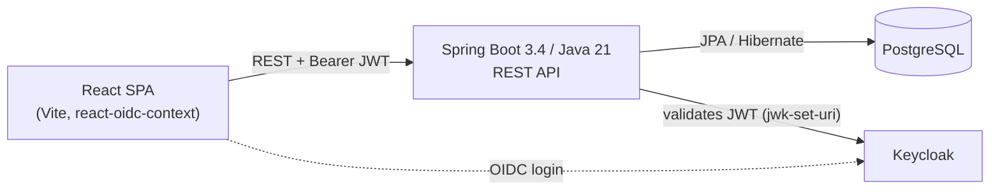

# ShowHop — Product Requirements Document

**Version:** 0.2.0 — Draft
**Status:** MVP complete (v0.1.0 tagged); Phase 1 & Phase 3 specified to build-ready depth ahead of implementation
**Stack:** Spring Boot 3.4 / Java 21 / React 18 + Vite / PostgreSQL / Keycloak

> **v0.2 changes.** Part I (current state) is unchanged from v0.1.0 — still MVP-complete and verified against the codebase. Part II is new: the two headline additions from the roadmap — the **webhook delivery engine** and the **payment & reservation flow** — are now specified to the same depth as a pre-build design doc, so the major design decisions are fixed *before* either goes to a branch. The payment flow is designed around **Razorpay**, not Stripe, with the selection rationale documented in §9.1 rather than assumed. Non-Goals, Success Metrics, Risks, and a rationale-bearing Phased Roadmap are added to match.

---

## Contents

1. [Overview](#1-overview)
2. [Users & Roles](#2-users--roles)
3. [Part I — Current State](#part-i--current-state)
   - [3.1 Architecture & Stack](#31-architecture--stack)
   - [3.2 Domain Model](#32-domain-model)
   - [3.3 API Surface](#33-api-surface)
   - [3.4 Security Model](#34-security-model)
   - [3.5 Correctness Guarantees](#35-correctness-guarantees)
4. [Part II — Planned Additions](#part-ii--planned-additions)
   - [4.1 Webhook Delivery Engine ("Mini-Svix")](#41-webhook-delivery-engine-mini-svix)
   - [4.2 Payment & Reservation Flow](#42-payment--reservation-flow)
   - [4.3 Sales Reporting Endpoint](#43-sales-reporting-endpoint)
   - [4.4 Parked — Staged Future Work](#44-parked--staged-future-work)
5. [Non-Goals](#5-non-goals)
6. [Success Metrics](#6-success-metrics)
7. [Risks & Open Questions](#7-risks--open-questions)
8. [Phased Roadmap](#8-phased-roadmap)
9. [Appendix](#9-appendix)
   - [9.1 Payment Processor Selection — Why Razorpay, Not Stripe](#91-payment-processor-selection--why-razorpay-not-stripe)

---

## 1. Overview

ShowHop is an event ticketing platform. **Organizers** create events with multiple ticket types, **attendees** discover and buy tickets, and **staff** validate tickets at the door by QR code or manual entry.

Part I describes the platform as it actually exists at `v0.1.0` — every claim is checked against the codebase, not aspirational. Part II specifies, at build-ready depth, the two features that turn ShowHop from "a well-built CRUD app with auth" into a system that demonstrates production engineering judgment: a **webhook delivery engine** that lets external systems reliably learn what happened, and a **payment & reservation flow** that makes the purchase path correct once money and an external, asynchronous payment processor are involved. Both are specified now, before either lands on a branch, so the hard design calls — the outbox correctness fix, the reservation/expiry model, the choice of payment processor — are made deliberately rather than discovered mid-implementation.

## 2. Users & Roles

One `User` entity, three Keycloak realm roles. A person can hold more than one role; the local database doesn't distinguish them beyond that.

| Role | Primary jobs |
|---|---|
| **Organizer** | Create/edit events, manage ticket types and pricing, monitor sales |
| **Attendee** | Browse published events, buy tickets, view QR codes |
| **Staff** | Validate tickets at the door, by QR scan or manual entry |

---

## Part I — Current State

Unchanged from v0.1.0 — verified against `backend/src/main/java/com/showhop`.

### 3.1 Architecture & Stack



| Layer | Choice |
|---|---|
| Web | Spring MVC (`spring-boot-starter-web`) |
| Persistence | Spring Data JPA + Flyway-managed PostgreSQL schema |
| Auth | OAuth2 Resource Server, Keycloak realm roles → Spring authorities |
| Mapping | MapStruct |
| QR codes | ZXing, rendered on demand (not cached) |
| Frontend auth | `react-oidc-context` (Authorization Code + PKCE) |
| Testing | JUnit 5 + Mockito (unit/slice), a real-Postgres integration suite via `docker compose` (see `docs/adr/0001`) |

### 3.2 Domain Model

Six entities, UUID-keyed, with `createdAt`/`updatedAt` audit columns.

| Entity | Key fields | Relations |
|---|---|---|
| **User** | `id` (= Keycloak subject), `name`, `email` | 1–N organized events; N–1 purchaser on tickets |
| **Event** | `name`, `venue`, `startsAt`, `endsAt`, `salesStart`, `salesEnd`, `status` | N–1 organizer; 1–N ticketTypes |
| **TicketType** | `name`, `description`, `price` (BigDecimal), `totalAvailable` | N–1 event; 1–N tickets |
| **Ticket** | `status` | N–1 ticketType; N–1 purchaser; 1–N validations; 1–1 QR code |
| **QrCode** | `status`, `generatedAt` | 1–1 ticket |
| **TicketValidation** | `status`, `method`, `validatedAt` | N–1 ticket; N–1 validating staff user (append-only log) |

`EventStatus`: DRAFT / PUBLISHED / CANCELLED / COMPLETED.
`TicketStatus`: PURCHASED / CANCELLED.
`TicketValidationStatus`: VALID / INVALID / EXPIRED.
`TicketValidationMethod`: QR_SCAN / MANUAL.

### 3.3 API Surface

| Method | Path | Access |
|---|---|---|
| POST/GET | `/api/v1/events` | ORGANIZER |
| GET/PUT/DELETE | `/api/v1/events/{id}` | ORGANIZER, ownership-checked |
| POST/GET/PUT/DELETE | `/api/v1/events/{eventId}/ticket-types[/{id}]` | ORGANIZER, ownership-checked |
| GET | `/api/v1/published-events[?q=]` | public |
| GET | `/api/v1/published-events/{id}` | public |
| GET | `/api/v1/published-events/{id}/ticket-types` | public |
| POST | `/api/v1/published-events/{eventId}/ticket-types/{id}/tickets` | any authenticated role (purchase) |
| GET | `/api/v1/tickets` / `/api/v1/tickets/{id}` | authenticated, own tickets only |
| GET | `/api/v1/tickets/{id}/qr-codes` | authenticated, own ticket only — PNG |
| POST | `/api/v1/ticket-validations` | STAFF |

Ticket purchase deliberately lives under `/published-events`, not `/events` — the ORGANIZER-only matcher on `/api/v1/events/**` would otherwise lock attendees out of buying tickets.

### 3.4 Security Model

- Keycloak issues JWTs; Spring Security validates them statelessly via `jwk-set-uri` (not `issuer-uri` — the latter does an eager OIDC-discovery network call at bean creation, which would make every context load, including plain tests, depend on Keycloak being reachable).
- A custom `JwtAuthenticationConverter` maps `realm_access.roles` onto Spring authorities.
- `UserProvisioningFilter` creates the local `User` row just-in-time from JWT claims on first authenticated request — no separate signup flow.
- Authorization is enforced at two levels: role-gated path matchers in `SecurityConfig`, and per-resource ownership checks in the service layer (e.g. `findByIdAndOrganizerId`).

### 3.5 Correctness Guarantees

- **Oversell-safe purchasing**: a `PESSIMISTIC_WRITE` lock on the `TicketType` row, combined with a status-aware sold count (only `PURCHASED` tickets count against capacity), serializes concurrent purchases. Verified by a 20-thread-vs-5-capacity concurrency test against both H2 and a real PostgreSQL instance.
- **No double-admission**: ticket validation is an append-only log; a second scan of an already-`VALID`-admitted ticket is recorded as `INVALID` rather than silently re-admitting.
- **Cross-tenant isolation**: an organizer cannot read or mutate another organizer's events or ticket types, verified by dedicated tests.

**Boundary of the current guarantee.** The lock above protects the *synchronous* purchase path only — `purchaseTicket` charges nothing and creates the `Ticket` row directly. The moment an external, asynchronous payment processor sits between "buyer commits to buy" and "ticket is created" (§4.2), the decision point moves, and the current lock alone stops being sufficient. That gap — not a bug today, but a known edge the current design doesn't yet cover — is exactly what §4.2 closes.

---

## Part II — Planned Additions

Ordered by portfolio value and dependency, not by ease. The webhook engine is the flagship addition and has no dependency on payments; the payment/reservation flow is the second deep feature and deliberately reuses the webhook engine's signing and idempotency primitives for its own inbound webhook.

### 4.1 Webhook Delivery Engine ("Mini-Svix")

**Status: Specified — targeted for Phase 1**

A standalone module that turns internal domain events into signed, retried, replayable HTTP deliveries to endpoints organizers or integrators register. This is the feature that reframes the project from "CRUD with auth" to "designed a subsystem."

#### Goals

- Let an external system reliably learn that `event.published`, `ticket.purchased`, `ticket.cancelled`, or `ticket.validated` happened — without polling.
- Guarantee at-least-once delivery with visible, replayable history, not fire-and-forget HTTP calls.
- Let receivers verify authenticity cryptographically, the same way Stripe/Razorpay/Svix/GitHub webhooks work.

#### Data model

| Entity | Purpose | Key fields |
|---|---|---|
| `WebhookEndpoint` | A URL an org wants events pushed to | `url, secret, subscribedEventTypes[], status (ACTIVE / DISABLED / CIRCUIT_OPEN), consecutiveFailures, circuitOpenedAt` |
| `WebhookEvent` | Immutable record of something that happened. **Written in the same transaction as the domain change** (the outbox). | `id, type, payload (JSONB), occurredAt` |
| `WebhookDelivery` | One event's delivery journey to one endpoint (not one attempt — attempts are counted on the row). | `endpointId, eventId, state, attempt, maxAttempts, nextRetryAt, lockedBy, lockedUntil, lastResponseCode, lastError` |
| `WebhookDeliveryAttempt` *(optional)* | Per-attempt audit row for the delivery log UI. | `deliveryId, attemptNo, requestBody, responseCode, latencyMs, at` |

#### Delivery flow — a *true* in-transaction outbox from day one

The naive version writes the `WebhookEvent` in an `@TransactionalEventListener(phase = AFTER_COMMIT)` handler. That runs **after** the domain transaction has already committed, in a *separate* transaction — a dual-write: if the process dies (or that second transaction fails) between the domain commit and the listener, the ticket is sold but **no event row exists and the webhook is lost forever**, silently breaking the at-least-once goal. ShowHop specifies the fix from the start: the `WebhookEvent` row is written **synchronously, inside the same `@Transactional` boundary as the domain change**, so the event is exactly as durable as the ticket. `WebhookDelivery` rows (the fan-out to subscribed endpoints) and the HTTP sending are done *afterwards* by a relay/worker reading committed `WebhookEvent` rows — never on the request thread.

```mermaid
sequenceDiagram
    participant Svc as Domain service<br/>(TicketPurchaseServiceImpl)
    participant Tx as Purchase DB transaction
    participant Store as WebhookEvent (outbox) table
    participant Relay as Fan-out relay<br/>(scheduled)
    participant Worker as Delivery worker(s)<br/>(competing consumers)
    participant Endpoint as Subscriber endpoint

    Svc->>Tx: create Ticket
    Svc->>Tx: INSERT WebhookEvent(type, payload)   %% SAME transaction — the outbox write
    Tx-->>Store: COMMIT (ticket + event atomic)

    loop scheduled fan-out
        Relay->>Store: read events with no deliveries yet
        Relay->>Store: INSERT one WebhookDelivery per subscribed, non-open endpoint (state=PENDING)
    end
    loop scheduled delivery poll
        Worker->>Store: claim due deliveries (FOR UPDATE SKIP LOCKED, set lease)
        Worker->>Endpoint: POST payload + HMAC signature + Idempotency-Key
        alt 2xx
            Endpoint-->>Worker: 2xx
            Worker->>Store: state=SUCCEEDED; endpoint.consecutiveFailures=0
        else error / timeout
            Endpoint-->>Worker: 4xx/5xx/timeout
            Worker->>Store: attempt++, schedule nextRetryAt (backoff+jitter) or DEAD_LETTER; bump breaker
        end
    end
```

#### Delivery state machine

```
PENDING ──claim(lease)──▶ IN_FLIGHT ──2xx──▶ SUCCEEDED
   ▲                          │
   │                          ├─ retryable failure & attempt < maxAttempts ──▶ RETRYING ──(nextRetryAt due)──▶ PENDING
   │                          │
   └──────────────────────────┴─ failure & attempt = maxAttempts ─────────────▶ DEAD_LETTER
                                                                                     │
                                       manual replay (§API) creates a fresh delivery ┘
```

- **`SUCCEEDED` / `DEAD_LETTER`** are terminal. Replay does not resurrect a delivery; it **creates a new one** for the same `(event, endpoint)` pair, so history stays immutable and auditable.
- A lease (`lockedBy` + `lockedUntil`) that expires (worker crashed mid-flight) makes the row eligible for re-claim — at-least-once, so a crash between "endpoint returned 2xx" and "we recorded SUCCEEDED" can re-send. That is why the receiver contract below requires idempotent handling.

#### Key design decisions

- **True transactional outbox, specified up front.** `WebhookEvent` is written in the domain transaction; delivery is relayed afterward. A rolled-back purchase writes no event; a committed purchase is *guaranteed* to have an event. There is no "v1 dual-write, v2 fix" step — the correct version is the only version built.
- **Lease-based claiming with `FOR UPDATE SKIP LOCKED`.** The worker claims due deliveries with `SELECT ... WHERE state IN (PENDING) AND nextRetryAt <= now() FOR UPDATE SKIP LOCKED LIMIT n`, stamps `lockedBy`/`lockedUntil`, and commits the claim before sending. Multiple worker threads or app instances therefore never grab the same row. This is a **competing-consumers** concurrency model — the hard part is safe claiming and lease expiry, not ordering.
- **HMAC-SHA256 signing.** Signature over `timestamp.payload`, sent as `Webhook-Signature`, per-endpoint secret, with the timestamp in a `Webhook-Timestamp` header so receivers can reject replays outside a tolerance window. The same signing/verification primitives are reused for *inbound* Razorpay webhooks (§4.2) — one signing story, two directions.
- **Idempotent delivery + receiver contract.** Every POST carries a stable `Idempotency-Key` (the `deliveryId`, or `eventId`+`endpointId`), and the docs state plainly: *deliveries are at-least-once; dedupe on the key.* This is what makes lease-expiry re-sends safe.
- **Exponential backoff with jitter, persisted.** `nextRetryAt` lives on the row (e.g. `min(base * 2^attempt, cap) ± jitter`), capped at `maxAttempts`, then `DEAD_LETTER`. Never an in-memory retry loop that dies with the process.
- **Per-endpoint circuit breaker with half-open probing.** After a configurable run of consecutive failures the endpoint goes `CIRCUIT_OPEN` (fan-out skips it). After a cooldown it goes **half-open**: a single probe delivery is allowed; success closes the circuit and resets `consecutiveFailures`, failure re-opens it. `consecutiveFailures` is mutated only by the single worker holding the delivery's lease, so the counter doesn't race.
- **Ordering scope, stated honestly.** v1 does **not** promise global ordering; it promises per-delivery at-least-once. Per-endpoint FIFO is a documented v2 concern (§4.4), not something v1 silently half-implements.

#### API & UI surface

| Method | Path | Purpose |
|---|---|---|
| POST | `/api/v1/webhook-endpoints` | Register an endpoint + event-type subscriptions |
| GET | `/api/v1/webhook-endpoints` | List endpoints for the organizer |
| PATCH | `/api/v1/webhook-endpoints/{id}` | Enable/disable, rotate secret, change subscriptions |
| GET | `/api/v1/webhook-endpoints/{id}/deliveries` | Delivery log — status, response code, latency, attempt count |
| POST | `/api/v1/webhook-deliveries/{id}/replay` | Manually re-send a specific delivery |

Frontend: a new organizer dashboard page listing endpoints with health indicators (Active / Disabled / Circuit-open), a delivery log with per-row expand for request/response bodies, and a one-click replay action.

---

### 4.2 Payment & Reservation Flow

**Status: Specified — targeted for Phase 3**

This is where ticketing has a genuinely hard problem the current synchronous purchase path hides: **money moves through an external payment processor, asynchronously, and the local ticket must appear exactly once, without overselling.** ShowHop targets the **Indian market**, so this flow is designed around **Razorpay** (rationale in §9.1) rather than Stripe — the *shape* of the problem (async confirmation, dedupe, oversell-at-fulfillment) is identical to Stripe-based designs, but several details differ enough to matter: amounts in paise, an embedded-checkout UX rather than a redirect, UPI-specific settlement timing, and Razorpay's own webhook signature/event conventions.

#### Why the naive version oversells

If availability is checked only when the payment order is *created*, then between order-create and the `payment.captured` webhook (seconds, or minutes for a UPI collect request the buyer must approve in their own app) other buyers complete their own payments. Nothing re-checks capacity at fulfillment, so a popular ticket type sails past `totalAvailable`. The current pessimistic lock (§3.5) protects the *synchronous* path perfectly and gives zero protection here, because the decision point has moved. The fix is a **reservation model**: capacity is committed at reservation time (under the same lock discipline that already works), held for a short TTL, and only *converted* to a sold ticket at fulfillment — driven by the **webhook**, never by the client-side success callback alone (see below).

#### Reservation inventory model

`TicketType` availability is no longer "count of tickets." It becomes three-way accounting: **available = totalAvailable − sold − activeHolds**. A new `TicketReservation` entity carries the hold.

| Entity | Purpose | Key fields |
|---|---|---|
| `TicketReservation` | A short-lived claim on inventory while payment is in flight. | `id, ticketTypeId, userId, quantity, state, expiresAt, razorpayOrderId, razorpayPaymentId, idempotencyKey` |

`state`: `HELD → CONFIRMED` (paid & fulfilled) / `EXPIRED` (TTL lapsed, released) / `CANCELLED` (buyer abandoned) / `FAILED` (payment failed).

This also **fixes the class of bug** the current model would otherwise reintroduce once cancellation-driven refunds exist: availability is computed from `sold + activeHolds`, where `sold` counts only `PURCHASED` tickets, so cancellations correctly free inventory (§3.5 already does this for the synchronous path; the reservation model carries the same discipline forward).

#### Why the client-side success handler is never the source of truth

Razorpay Checkout is an **embedded JS modal**, not a redirect like Stripe Checkout — the buyer never leaves the page, and a client-side `handler` callback fires with `razorpay_payment_id` / `razorpay_order_id` / `razorpay_signature` on apparent success. It is tempting to fulfill the ticket right there. **ShowHop deliberately does not** — the callback can be spoofed (it's client JS, not a server-verified event), the tab can be closed or the network can drop between capture and callback delivery, and a UPI collect-request payment can be approved by the buyer *after* the page has already timed out or been abandoned. The **webhook is the only trusted signal**; the client-side callback is used only for optimistic UI ("processing your payment…"), never to create a `Ticket`.

#### Purchase saga (reserve → pay → fulfill, with compensations)

```mermaid
sequenceDiagram
    participant C as Buyer
    participant API as Purchase API
    participant DB as Postgres
    participant RP as Razorpay Checkout
    participant WH as Razorpay webhook handler
    participant Reaper as Reservation reaper

    C->>API: POST purchase (Idempotency-Key)
    API->>DB: LOCK TicketType row (existing pessimistic lock)
    API->>DB: available = total − sold − activeHolds; if < qty → 409 SOLD_OUT
    API->>DB: INSERT TicketReservation(state=HELD, expiresAt=now+TTL)
    API->>RP: create Order (amount in paise, INR, receipt=reservationId)
    API-->>C: 200 { razorpayOrderId, razorpayKeyId }
    C->>RP: opens embedded Checkout, pays (card / UPI / netbanking / wallet)
    RP-->>C: client-side handler fires (optimistic UI only — NOT trusted)

    alt payment captured
        RP-->>WH: payment.captured (signed, X-Razorpay-Signature)
        WH->>DB: verify HMAC signature; dedupe on Razorpay event id (inbound idempotency)
        WH->>DB: LOCK TicketType; re-assert reservation still HELD & not expired
        WH->>DB: reservation→CONFIRMED; create Ticket(s); generate QR
        WH->>DB: publish ticket.purchased WebhookEvent (same txn — §4.1 outbox)
    else buyer abandons / TTL lapses
        Reaper->>DB: find HELD reservations past expiresAt
        Reaper->>DB: reservation→EXPIRED (inventory released automatically)
    else payment fails
        RP-->>WH: payment.failed
        WH->>DB: reservation→FAILED (inventory released)
    end
```

#### Key design decisions

- **Reserve under the lock that already works.** The hold is created inside the existing `PESSIMISTIC_WRITE` transaction on the `TicketType` row, so the *reservation* step is oversell-safe by the same mechanism §3.5 already validates — extending the proven lock to a new decision point, not inventing a new concurrency scheme.
- **Re-assert at fulfillment.** The webhook handler re-takes the lock and re-checks the reservation is still `HELD` and unexpired before creating tickets. Edge case handled explicitly: **paid but reservation expired** (buyer's UPI approval lands after the reaper fired) → do not silently drop; create the ticket if capacity still allows, otherwise **auto-refund via Razorpay's Refunds API** and surface it. The policy is stated, not left implicit (open question tracked in §7).
- **Inbound webhook idempotency.** Razorpay **retries** webhook delivery on non-2xx responses and can, in principle, redeliver; the handler dedupes on Razorpay's event id (a `processed_razorpay_events` row or unique constraint), so a redelivered `payment.captured` fulfills exactly once. This reuses the *same idempotency discipline* as the outbound engine (§4.1) — one story, both directions.
- **The charge-vs-commit divergence is bounded by direction of failure.** Money is only captured when Razorpay reports `payment.captured`; the local ticket is created *after*, driven by the webhook. So the failure mode is "paid, local fulfillment pending/failed" — recoverable by webhook retry and, worst case, the auto-refund path — never "ticket issued but not paid."
- **Idempotent purchase initiation.** The `POST purchase` carries a client `Idempotency-Key`; a retried initiation returns the *same* reservation + `razorpayOrderId` instead of creating a second hold (which would double-deduct inventory).
- **Reaper job.** A scheduled task releases `HELD` reservations past `expiresAt`. Claiming is safe under concurrency (bounded batch, `FOR UPDATE SKIP LOCKED`), mirroring the delivery worker (§4.1) — reservation and webhook subsystems share the same "safely drain a due-work table" primitive.
- **Automatic capture, INR-only, amounts in the smallest unit.** Razorpay Orders are created with `payment_capture: automatic` (capture on authorization, no separate manual-capture step to orchestrate) and amounts expressed in **paise** (`price * 100`, integer), matching Razorpay's API contract and avoiding floating-point amount bugs.
- **UPI-aware TTL.** Card payments confirm in seconds; a UPI collect request can sit pending for several minutes while the buyer approves it in their UPI app. The reservation TTL (§7) is set with this in mind — long enough that a normal UPI flow doesn't spuriously expire, short enough that a hot on-sale doesn't get starved by abandoned holds.

#### API surface (additions)

| Method | Path | Purpose |
|---|---|---|
| POST | `/api/v1/events/{eventId}/ticket-types/{ticketTypeId}/reservations` | Reserve inventory + create a Razorpay Order; returns `{ razorpayOrderId, razorpayKeyId, amount }` for the frontend to open Checkout |
| POST | `/api/v1/razorpay/webhook` | Inbound Razorpay events (signature-verified, idempotent) — fulfillment happens here |
| GET | `/api/v1/reservations/{id}` | Buyer polls reservation/payment state (SPA shows "processing…" until the webhook confirms) |

**Non-goals for this flow (unchanged from §5):** single-currency (INR) only; no tax/GST engine beyond pass-through pricing; no partial refunds beyond the oversell auto-refund path; no saved-card / recurring / auto-pay charging.

---

### 4.3 Sales Reporting Endpoint

**Status: Planned — targeted for Phase 5**

Serves the organizer persona's stated need for a sales dashboard.

- **`GET /api/v1/events/{eventId}/report`** — revenue and units by ticket type, plus a time-series (sales per day/hour) over a query-parameter date range, scoped to the requesting organizer (ownership enforced in the service layer, consistent with existing patterns).
- **`GET /api/v1/events/{eventId}/report.csv`** — same data as a streamed CSV export for finance/spreadsheet use.
- Backed by aggregate queries over `tickets` joined to `ticket_types` (and, once payments land, actual captured amounts in INR rather than list price). Read-only; a natural first consumer of the Redis cache in §4.4 if the aggregates get heavy, but correct without it.

This is intentionally **breadth, not depth** — a rounding-out feature, not a headline.

---

### 4.4 Parked — Staged Future Work

This section holds two kinds of item, and the distinction matters:

- **Companion foundations (sequenced, not parked).** The Testcontainers suite (already partially addressed — see ADR-0001), observability, and further security hardening are *not* optional polish — they are what makes the two deep features read as production work rather than a demo, and the roadmap (§8) sequences them in Phases 2 and 4 alongside the features. Marked **[foundational]**.
- **Genuinely deferred (parked as narrative).** Redis caching, a real message broker, and the advanced-scale items are kept as *reasoning* — "here's why we'd add it, and roughly how" — because building them now adds surface area without proportional payoff. Marked **[deferred]**.

**Reliability & correctness**

| Item | Status | Description |
|---|---|---|
| Idempotency keys on purchase | specified in §4.2 | A retried `POST` returns the same reservation instead of double-holding inventory. |

**Observability**

| Item | Status | Description |
|---|---|---|
| Actuator + Micrometer + Prometheus | [foundational] | Health/readiness probes; request, delivery-worker, and reservation-reaper metrics (Phase 4). |
| Structured logging + correlation IDs | [foundational] | Trace a purchase through fulfillment to its webhook deliveries (Phase 4). |
| OpenTelemetry tracing | [foundational] | End-to-end span across purchase → reservation → Razorpay fulfillment → event publish → delivery attempt (Phase 4). |

**Security hardening**

| Item | Status | Description |
|---|---|---|
| Rate limiting | [foundational] | Bucket4j on `/published-events` search and the reservation endpoint (Phase 4). |
| Org-scoped API keys | [foundational] | Programmatic access separate from a user's Keycloak session, for the webhook-management API itself (Phase 4). |
| Audit log | [foundational] | Who changed/cancelled/overrode/refunded what, and when (Phase 4). |

**Scalability**

| Item | Status | Description |
|---|---|---|
| Redis cache | [deferred] | Published-event listing/search, and (later) the reporting aggregates of §4.3. Add when read volume justifies it, not before. |
| Real message broker | [deferred] | Move webhook delivery off DB-polling onto RabbitMQ/SQS *once the naive version is proven*. The DB-polling + `SKIP LOCKED` design (§4.1) is chosen precisely so this migration is a clean later step, not a day-one dependency. |
| Per-endpoint FIFO delivery | [deferred] | If an integrator ever needs ordered delivery per endpoint, add a queue/partition per endpoint. v1 promises at-least-once, not ordering (§4.1). |
| Virtual waiting room (high-demand on-sale) | [deferred] | A fair admission queue for a hot on-sale (token-bucket + Redis sorted-set FIFO + backpressure). Advanced-tier and over-scope for this project; noted so the ceiling is acknowledged rather than pretended away. |

**Testing & delivery**

| Item | Status | Description |
|---|---|---|
| Testcontainers integration suite | [foundational] | Extend the existing docker-compose Postgres suite (ADR-0001) to cover the reservation/expiry race and the webhook retry/backoff + signature paths (Phase 2). |
| CI pipeline | [foundational] | GitHub Actions: build, test, image, deploy (Phase 2). |
| Webhook payload contract tests | [foundational] | Pin the event schema so downstream integrators don't break silently (Phase 2). |
| Razorpay webhook fixture tests | [foundational] | Recorded `payment.captured` / `payment.failed` fixtures with known signatures, so signature verification and dedupe are tested without hitting Razorpay's sandbox on every run (Phase 3). |

---

## 5. Non-Goals

- Building a generic, multi-tenant webhook-as-a-service product — the engine is scoped to this platform's own event catalog, not a reusable SaaS.
- Native mobile apps — the React SPA covers organizer, attendee, and staff flows; an installable PWA wrapper is a possible future item, not this phase.
- Multi-currency / international payments — INR-only via Razorpay, for now (§9.1).
- GST/tax computation — pricing is pass-through; no tax engine.
- Horizontal write-scaling of the ticket-purchase path beyond what row-level locking provides — acceptable until real load data says otherwise.

## 6. Success Metrics

| Metric | Target |
|---|---|
| Webhook delivery success rate (first attempt) | > 98% to a healthy endpoint |
| Webhook delivery latency (event committed → first attempt) | < 5s p95 |
| Webhook event durability | Zero committed purchases with a missing `WebhookEvent` (guaranteed by the in-transaction outbox, §4.1) — asserted by a crash test between commit and fan-out |
| Concurrent purchase correctness (sync path) | Zero oversells under load test at 50 concurrent buyers per ticket type (already holds, §3.5) |
| Concurrent reservation correctness (async path) | Zero oversells at 50 concurrent buyers when capacity is committed at *reservation* and re-checked at *fulfillment*; expired holds provably release inventory |
| Payment fulfillment exactly-once | A redelivered Razorpay `payment.captured` fulfills exactly one ticket (inbound idempotency, §4.2) |
| Automated test coverage on critical paths | Integration tests covering purchase-lock contention, reservation expiry, retry/backoff, and signature verification |

## 7. Risks & Open Questions

- **Payments sequencing — decided.** The reservation saga bounds the charge-vs-commit divergence to the safe direction. The paid-but-expired policy (a buyer's UPI approval lands after the reaper expires their hold and capacity is now gone) had two candidates: (a) auto-refund, or (b) hold a small over-capacity buffer to honor them regardless. **Decision: (a), auto-refund** — implemented in `RazorpayWebhookServiceImpl`. A capacity buffer silently breaks the organizer-configured `totalAvailable` promise (a venue/fire-code constraint, not a soft target), and a fixed buffer doesn't actually bound the risk: several late payments landing close together could each see "capacity still available" against the same buffer and blow past it collectively. A refund is a fully standard, reversible operation with a known cost (buyer friction on the rare race); an oversold venue is not reversible. No further confirmation needed before this ships.
- **Reservation TTL — decided.** Too short and legitimate UPI payers (who can take minutes to approve in-app) lose their hold; too long and inventory is starved during a hot on-sale. Per-payment-method tuning was considered and rejected: Razorpay Checkout doesn't reveal which method the buyer will pick until *after* the Order is created and the modal opens, so the reservation's TTL has to be chosen before that's known — there's no hook to set a shorter TTL for a card payer and a longer one for a UPI payer within a single Order. **Decision: a single flat default of 15 minutes** (`showhop.razorpay.reservation-ttl`, still an operator-tunable knob, not a constant), biased toward UPI's slower confirmation window since a card payer's few-second flow has ample margin either way.
- **Outbox growth.** `WebhookEvent` / `WebhookDelivery` / `TicketReservation` / `WebhookDeliveryAttempt` tables all grow unbounded without retention. Needs a TTL/archival policy (e.g. prune `SUCCEEDED` deliveries and terminal reservations past N days) before real traffic.
- **Razorpay sandbox fidelity.** Razorpay's test mode simulates UPI/card flows but not every real-world failure mode (e.g. bank-side timeouts); the paid-but-expired race in particular may need to be tested via a synthetic delay rather than relying on sandbox timing.
- **Scope discipline.** The temptation is to build every roadmap item in parallel. This document deliberately promotes only the webhook engine and the payment/reservation flow to "specified in depth" and parks the rest (§4.4); the phasing below enforces that.

## 8. Phased Roadmap

Each phase is deployable and demoable on its own; later phases assume earlier ones are done.

### Phase 1 — Webhook Delivery Engine
Self-contained, no dependency on payments or infra changes. Highest portfolio signal per unit of effort — ships the outbox, signing, retry/backoff, circuit breaker, and the management UI.

### Phase 2 — Foundations: extended test coverage + CI
Extends the existing docker-compose Postgres suite (ADR-0001) with contract tests for the webhook payload schema, and stands up a GitHub Actions CI pipeline, before more features land.

### Phase 3 — Payments & Reservation (§4.2)
Razorpay Checkout + inbound webhook fulfillment, the reservation/expiry inventory model, the reaper, and fulfillment-time oversell re-check — reusing Phase 1's signature-verification and idempotency primitives. Closes the biggest gap between this app and a real ticketing business, and is the second *deep* feature.

### Phase 4 — Observability & hardening
Actuator/Micrometer/tracing (spanning purchase → reservation → fulfillment → delivery), rate limiting, org-scoped API keys, and an audit log — the operational layer that makes the previous phases trustworthy in production. All **[foundational]** items from §4.4 land here.

### Phase 5 — Reporting & (deferred) scale
The sales-reporting endpoint (§4.3). Redis caching and a real message broker remain **[deferred]** (§4.4): introduced only if/when read volume or delivery throughput data justifies them.

---

## 9. Appendix

### 9.1 Payment Processor Selection — Why Razorpay, Not Stripe

ShowHop targets Indian organizers and attendees, so the payment processor choice isn't cosmetic — it changes the shape of §4.2's design. This section documents the decision rather than assuming it.

**Options considered:**

| Processor | Notes |
|---|---|
| **Stripe** | Best-in-class docs and the default reference design for this class of problem (it's what devtiro's PRD specifies). But Stripe's India support is limited for new merchants — Stripe stopped onboarding new India-based businesses for domestic INR payments some years back; a ShowHop deployment for actual Indian organizers would need Stripe Atlas / a foreign entity, or Stripe Connect through an intermediary. Wrong default for an India-first product. |
| **Razorpay** | India's dominant payment gateway for exactly this use case (events, ticketing, D2C). Native UPI, cards, netbanking, and wallets in one integration; strong developer docs and a well-supported Java SDK; webhook model (HMAC-signed, event-based, retried on non-2xx) that maps directly onto the same signing/idempotency primitives §4.1 already builds. **Selected.** |
| **Cashfree** | Also India-focused, comparable feature set to Razorpay (UPI, cards, netbanking) and a legitimate alternative. Slightly smaller ecosystem/mindshare and less prevalent as a portfolio-recognizable name than Razorpay; no technical blocker, just a weaker signal for a portfolio project. |
| **PayU India** | Mature, broad payment-method coverage, but historically weaker webhook/API ergonomics and less consistent sandbox documentation than Razorpay for a from-scratch integration. |
| **Instamojo** | Simpler, invoice/payment-link oriented; a good fit for a one-off payment page, not for an embedded checkout + programmatic Orders API the reservation saga needs. |

**Decision: Razorpay.** It is the standard choice for an India-targeted ticketing platform, has first-class UPI support (which materially matters for the reservation TTL design, §4.2), and its webhook and signing model is close enough to Stripe's that the *design pattern* devtiro's PRD specifies (in-transaction outbox → reservation → webhook-driven fulfillment → inbound idempotency) transfers with the same rigor, not a weaker one. The differences that do matter are called out explicitly in §4.2 rather than glossed over:

1. **Embedded checkout, not redirect.** Razorpay's Checkout is a JS modal the buyer completes without leaving the page; Stripe Checkout is a hosted redirect page. This changes nothing about *why* the webhook must be authoritative (both are still asynchronous relative to the server), but it does mean the client-side "success" callback is even more tempting to (wrongly) trust, since it feels synchronous. §4.2 calls this out as a specific decision, not an oversight.
2. **UPI settlement timing.** A UPI collect request can be pending for minutes while the buyer approves it in a separate app. This directly drives the reservation TTL discussion in §7 — a Stripe-only design tuned around card-payment timing (seconds) would under-provision the hold window for ShowHop's actual payment mix.
3. **Amounts in paise, INR-only.** Razorpay's API takes integer paise, not decimal rupees — the same "avoid floating point money" discipline as Stripe's cents, but worth stating since it's a common integration bug.
4. **Automatic capture.** Razorpay supports both manual and automatic capture; ShowHop specifies automatic capture (capture on authorization) so there's no separate "capture" step to orchestrate in the saga — simplifying the state machine relative to a manual-capture design.
5. **Refunds** use Razorpay's Refunds API for the paid-but-expired-and-oversold compensation path (§4.2, §7) — functionally equivalent to Stripe's refund API, different endpoint/SDK shape.

No other part of the design changes: the reservation model, the outbox-driven webhook engine, the lease-based delivery worker, and the idempotency discipline are all processor-agnostic and were designed that way deliberately, so swapping the processor decision didn't require re-deriving the saga from scratch.

---

*Current-state sections verified directly against `backend/src/main/java/com/showhop`; planned-addition sections in Part II reflect a build-ready specification, subject to revision only if implementation surfaces a design flaw — not as a placeholder awaiting future thought.*
